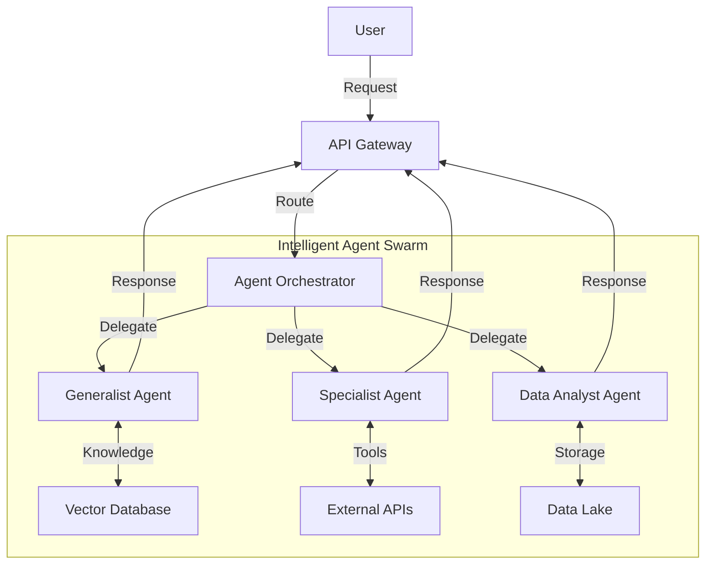

# Hi there, I'm Beka Kakachia 👋

---

## 🧠 **About Me**

I am a **System Architect & AI Engineer** passionate about designing and building intelligent systems. My expertise lies in creating scalable architectures and leveraging Artificial Intelligence to solve complex problems.

I am the founder and lead architect of **[SyntrofAI](https://syntrofai.com/)**, a multi-agent operating system platform designed to revolutionize how AI agents interact and collaborate.

---

## 🚀 **My Expertise**

### **AI Fields & Interests**

| AI Domain | Focus Area |
| :--- | :--- |
| 🤖 **Large Language Models (LLMs)** | Fine-tuning, RAG Systems, Prompt Engineering |
| 🧩 **Multi-Agent Systems** | Orchestration, Autonomous Agents, Swarm Intelligence |
| 🧪 **Machine Learning Ops** | MLOps Pipelines, Model Deployment, Scalability |
| 🖥️ **System Architecture** | Distributed Systems, Cloud Infrastructure (AWS/GCP) |
| 📊 **Data Engineering** | Pipelines, Processing, Analysis |
| 🛡️ **AI Safety & Ethics** | Responsible AI, Alignment Research |

---

## 🛠️ **Tech Stack**

### **Core Technologies**

### **AI & ML Libraries**

---

## 🏗️ **System Architecture Visualization**

My approach to system design involves visualizing complex interactions. Below is a conceptual representation of a multi-agent system architecture (similar to principles used in SyntrofAI):

---

## 📈 **GitHub Stats**

---

## 📫 **Connect with Me**

