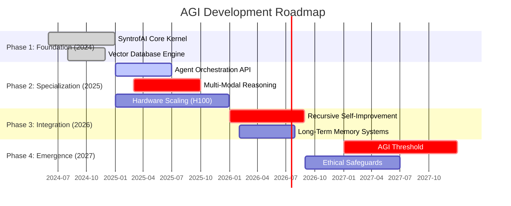

# Beka Kakachia

### *System Architect & AI Engineer* | *Founder of SyntrofAI* | *AGI Researcher*

---

## 🧭 **The Mission: AGI by 2027**

I am on a relentless pursuit to achieve Artificial General Intelligence (AGI) by the year 2027. This is not just a goal; it is a mathematical, engineering, and philosophical challenge that defines my work.

> "Intelligence is the only resource that can multiply itself. My mission is to build the architecture that facilitates this exponential growth."

---

## 🏗️ **The Architect's Stack: Materials & Tools**

To build the impossible, one must master the tangible. Here is the complete arsenal I employ to construct intelligent systems.

### **Hardware Infrastructure**

| Layer | Technology | Purpose |
| :--- | :--- | :--- |
| **Compute** | NVIDIA H100 / A100 Clusters | High-performance training & inference |
| **Storage** | NVMe Arrays & Distributed Object Stores | Rapid data access for vector databases |
| **Networking** | InfiniBand / 100GbE | Low-latency inter-node communication |
| **Edge** | Raspberry Pi 5 / Jetson Orin | Distributed agent deployment |

### **Software Foundations**

### **AI & Cognitive Architecture Tools**

---

## 🧠 **Cognitive Domains & Expertise**

My work spans the entire spectrum of artificial intelligence, from low-level engineering to high-level philosophical alignment.

### **1. Large Language Models (LLMs)**
*   **Pre-training:** Distributed data parallelism, tokenizer optimization, transformer architecture scaling.
*   **Post-training:** RLHF (Reinforcement Learning from Human Feedback), DPO (Direct Preference Optimization), Instruction Tuning.
*   **Inference:** KV-Cache optimization, TensorRT-LLM, Quantization (GPTQ/AWQ).

### **2. Multi-Agent Systems (MAS)**
*   **Orchestration:** Dynamic task decomposition, agent routing, consensus mechanisms.
*   **Communication:** Protocol design (A2A), shared memory architectures, vectorized state passing.
*   **Emergent Behavior:** Studying group dynamics and collective intelligence in agent swarms.

### **3. System Design & Architecture**
*   **Patterns:** Event-driven architecture, microservices, CQRS (Command Query Responsibility Segregation).
*   **Scalability:** Horizontal scaling, load balancing, fault tolerance.
*   **Observability:** Distributed tracing, metrics aggregation (Prometheus/Grafana).

### **4. Theoretical AI & AGI Research**
*   **Alignment:** Value loading, corrigibility, interpretability (feature visualization).
*   **Cognitive Modeling:** Symbolic vs. Connectionist approaches, hybrid systems.
*   **Singularity Dynamics:** Timelines, capability curves, and resource requirements for AGI.

---

## 📅 **The Roadmap to 2027**

This is the trajectory of my current projects and future focus.

---

## 🏢 **SyntrofAI**

**SyntrofAI** is the embodiment of this vision. It is a multi-agent operating system designed to scale intelligence. Unlike standard frameworks, SyntrofAI focuses on **resource allocation** and **emergent protocol negotiation** between agents.

> *Status: Closed Source (Alpha)*

---

## 📊 **GitHub Statistics**

---

## 📡 **Connect & Collaborate**

I am open to high-impact collaborations, research partnerships, and visionary discussions regarding AGI development.

