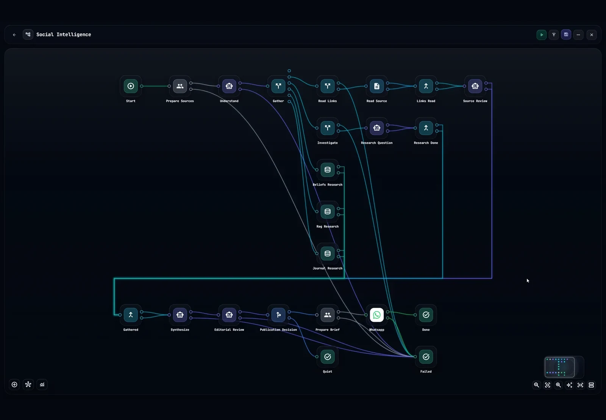

  <a href="https://syntrofai.com"><strong>SyntrofAI ↗</strong></a>
  &nbsp; / &nbsp;
  <a href="#building-syntrofai">The product</a>
  &nbsp; / &nbsp;
  <a href="#why-im-building-it">My story</a>
  &nbsp; / &nbsp;
  <a href="https://docs.syntrofai.com">Product docs</a>
  &nbsp; / &nbsp;
  <a href="mailto:beka@syntrofai.com">Contact</a>
  &nbsp; / &nbsp;
  <a href="https://x.com/bkakachia777">X</a>
  &nbsp; / &nbsp;
  <a href="https://www.linkedin.com/in/beka-kakachia/">LinkedIn</a>

 

## Building SyntrofAI

SyntrofAI is an AI team that runs a company's work and answers for it. You give it one sentence:

<table>
  <tr>
    <td width="50%" valign="top">
      
       <b>"Fill this quarter's pipeline."</b> 
      It reads the market, writes to the right people, books next week's meetings, and comes back with three decisions for you.
    </td>
    <td width="50%" valign="top">
      
       <b>"Run our socials this week."</b> 
      Then "What did we agree with Oakmere in March?", answered from memory. Then "Build a game for our launch."
    </td>
  </tr>
  <tr>
    <td width="50%" valign="top">
      
       <b>"Make everything for our launch."</b> 
      Then "Get us to $10M ARR", with a team of agents on it, and a hiring workflow that runs every Monday.
    </td>
    <td width="50%" valign="top">
      
       <b>"Find a cheaper battery electrolyte."</b> 
      Thousands of options read and ranked. It all reaches you on your phone, and only your decisions do.
    </td>
  </tr>
</table>

Clips from the SyntrofAI film. Watch it whole on <a href="https://syntrofai.com">syntrofai.com</a>.

Inside the app:

<table>
  <tr>
    <td width="50%" valign="top">
      
       <b>You give it the outcome</b> 
      Tell Nova what you want in plain words, in the chat or from WhatsApp. It asks what's missing, proposes a plan, then works in a browser and apps you can watch beside the chat.
    </td>
    <td width="50%" valign="top">
      
       <b>A company of agents does it</b> 
      Over a hundred specialist agents, organised into departments and teams. Give a team one mission and a coordinator splits the work. You get one deliverable.
    </td>
  </tr>
  <tr>
    <td width="50%" valign="top">
      
       <b>Work that repeats runs itself</b> 
      A process you repeat becomes a workflow: sources researched in parallel, merged, reviewed, and delivered as a brief on WhatsApp. It runs on a schedule, even with the browser closed.
    </td>
    <td width="50%" valign="top">
      
       <b>A computer of its own</b> 
      A full desktop with real apps runs on your instance. Nova works in it with mouse and keyboard, the way a person would, and you share the same screen.
    </td>
  </tr>
</table>

SyntrofAI is proprietary and its source code is private. The [documentation](https://docs.syntrofai.com) shows how every part works.

**[Explore the product →](https://syntrofai.com)**

 

## Why I'm building it

An AI agent once told me four times that there was no API key. There was.

I didn't laugh it off. I started in cybersecurity, and the first thing that work teaches you never leaves: trust nothing you can't verify. So I wrote it down. Then I kept writing them down, every time an agent's work, or its report about its work, was wrong. A test run reported as passing while more than half of its sessions had died. A confident fix for a "typo" in a setting that was right all along, and would have broken a paid subscription.

Before SyntrofAI I worked in graphic design, sales and marketing, then spent four years automating business processes for companies and individuals. Every owner I worked with wanted the same thing, and it wasn't another tool. They wanted to hand the work off and know it was done right.

AI still doesn't give you that. You prompt it, check what comes back, fix it, and do it again tomorrow. The work still runs through you. And the moment you let an agent act on its own, you're trusting a report you can't check.

In September 2025 I went full-time on SyntrofAI, alone, from Tbilisi. I build it with AI coding agents running side by side. I decide what gets built, and I review and ship every change myself. That's close to 3,000 commits so far.

The log of agent mistakes taught me what the whole product rests on. The rules I wrote down didn't hold. The checks that refuse an action did. So that's how SyntrofAI works:

- Every action is written down before it happens.
- A separate check reads the evidence before anything counts as done.
- A correction you make once becomes a rule.
- Only the decisions that need you reach you.

What I want is a company where a founder with a few people runs what used to take a hundred, and trusts the work because it answers for itself.

[The short version, on the blog →](https://syntrofai.com/blog/why-i-built-syntrofai)

 

## Connect

Working on **retrieval, context engineering, or reliable agents**? I'd be glad to compare notes.

**[SyntrofAI](https://syntrofai.com)** &nbsp; · &nbsp; **[Documentation](https://docs.syntrofai.com)** &nbsp; · &nbsp; **[Email](mailto:beka@syntrofai.com)**

 

